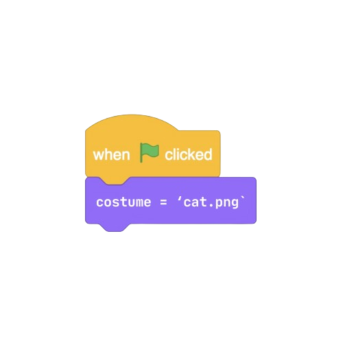

<h1 align="center">py2scratch</h1>

<p align="center">A module that converts python into scratch projects<p>

## Installation

Just `pip install` this, Depencies are currently `pillow`, `mutagen` and `astroid`!

```cmd
pip install py2scratch
```
